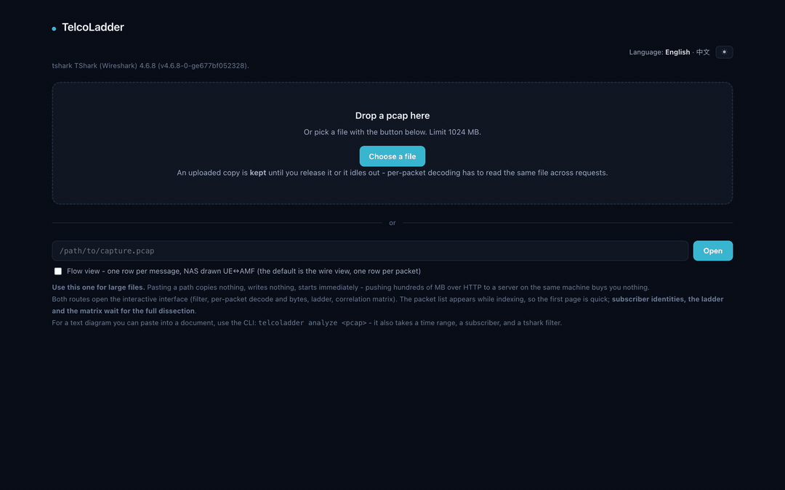
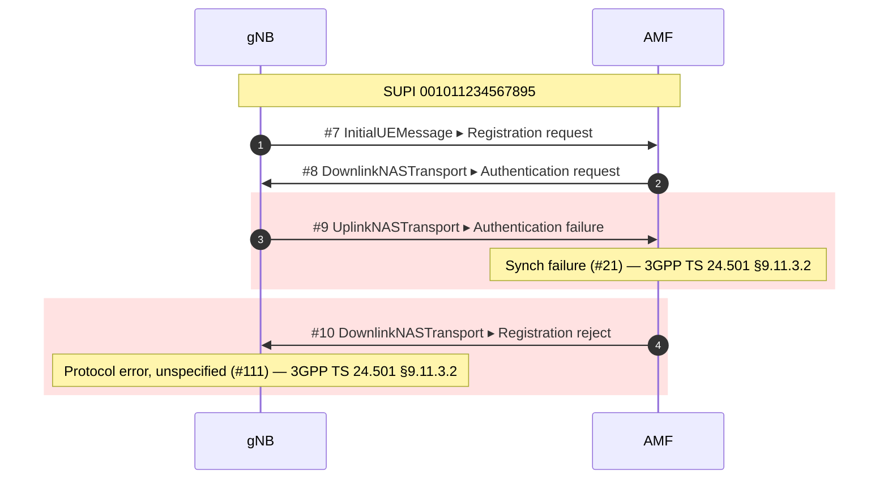

# TelcoLadder

<!-- mcp-name: io.github.gollumw/telcoladder -->

**Deterministic 5G / 4G / IMS signalling analyzer and call-flow correlator.**
The correlation and root-cause layer on top of `tshark`: one subscriber across
every interface, every failure explained from a verified cause table, and
nothing generated.

[](https://github.com/gollumw/TelcoLadder/actions/workflows/ci.yml)
[](https://pypi.org/project/telcoladder/)
[](https://pypi.org/project/telcoladder/)
[](#what-it-reads)
[](#how-it-is-verified)
[](#air-gapped-by-construction)
[](LICENSE)

For core-network SRE and R&D, RAN/core interoperability test, and third-line
troubleshooting at vendors and operators. It assumes you already read
signalling for a living.

```bash
pip install telcoladder
telcoladder check                             # verifies tshark and its dissectors
telcoladder summarize failed_attach.pcapng    # one page of facts, every failure cited
```



## What you get

Two outputs from one analysis. Mermaid you can paste into a ticket:



That is real output from `tests/fixtures/ki-mismatch`, not an illustration: a UE
provisioned with the wrong key, captured on a local Open5GS testbed. It is
**not** the MAC failure you would expect — a UE whose K does not match computes
an AUTS the network cannot resynchronise from, so you get `#21` and then a bare
`#111`. The cause table says so because we ran it, not because it sounded right.

And the same capture in the browser: a packet list driven by real `tshark`
display filters, per-frame decode tree and bytes, the ladder with the initiator
and the cause on every failing event, and a per-PDU-session matrix where every
cell cites the frame it came from.


## What it reads

| Generation | Protocols | Cause explanations |
|---|---|---|
| **5G core** | NGAP, NAS-5GS, HTTP/2 SBI, PFCP, GTP-U | 206 |
| **4G / EPC** | S1AP, NAS-EPS, GTPv2-C (S11, S5/S8, N26) | 236 |
| **IMS** | SIP (calls, KPIs), Diameter, H.248/MEGACO | 333 |

Every cause code is resolved through a hand-verified table to the specification
it comes from, what it means in plain language, and the root causes that
actually produce it in the field — **775 of them**, every name taken verbatim
from `tshark` and re-checked against it by a test. Nothing is generated: a cause
the table does not carry is reported as not catalogued, and a clause number is
printed only where a person transcribed it. Every network function is named
rather than shown as an IP, with the evidence for that name on hover.

## The pain, and what replaces it

| Today | With TelcoLadder |
|---|---|
| Copying UE IDs by hand between windows to follow one subscriber | One subscriber's whole lifetime in one flow: SUPI, 5G-S-TMSI, NGAP and S1AP UE IDs, TEIDs, Call-ID — with keys that are recycled treated as recycled |
| N2 and SBI in separate captures that never line up | N2, SBI and N4 stitched on one timeline; N4 joins through the GTP-U tunnel endpoint the UPF allocated and NGAP relayed |
| An N26 handover spread across NGAP, N26, S11 and S1AP | One segment across all four, joined through the S1-U SGW F-TEID the MME copies from Create Session Response into HandoverRequest |
| A bare cause number and a trip to the spec | 775 causes with the specification named, plain language and field root causes; clauses where a person checked them |
| RAN and core blaming each other for a dropped context | Every UE context release marked **requested by the RAN** or **ordered by the core** — a wire fact, not an opinion |
| A procedure that stalls for no visible reason | The gap named when it matches a NAS timer's default (T3560, T3460 …), and failures counted by TAC, cell, DNN and core element |
| Customer captures that must never leave the building | A command on your machine: no network listener beyond `127.0.0.1`, no telemetry, no cloud, no model |

## Thirty seconds, four ways in

```bash
# 1. CLI — one page of deterministic facts, Markdown or JSON
telcoladder summarize capture.pcapng
telcoladder analyze capture.pcapng -o flow.mmd      # Mermaid, byte-for-byte reproducible

# 2. Browser — drop a capture, or paste a path for anything large
telcoladder serve                                   # http://127.0.0.1:3005

# 3. AI agent — the same facts as MCP tools over stdio
claude mcp add telcoladder -- telcoladder mcp
```

**5. Hand a capture to someone else.** `telcoladder anonymize in.pcap out.pcap`
rewrites subscriber identities, addresses, hostnames, PLMN and cell identifiers
into keyed pseudonyms of the *same length* — TBCD, ASCII, JSON and HPACK-Huffman
alike — recomputes every checksum, then re-reads its own output and refuses to
keep it if any original value is still visible. The output walks the same
pipeline to the same procedures, roles and failures; only the names differ.
Same key, same pseudonyms across captures; the key is printed once and never
written down. Compressed HTTP/2 bodies cannot be rewritten in place and are
refused unless `--blank-opaque-bodies`.

**4. Windows, no install.** Download `TelcoLadder-Windows-x64.zip` from the
[Releases](https://github.com/gollumw/TelcoLadder/releases) page — a standalone
executable in a portable zip, built by CI from the tagged source. Unzip,
run `check-environment.cmd`, and use `telcoladder.exe` from that folder. It
needs Wireshark 4.0 or newer on the machine, nothing else.

Requires Python 3.11+ and `tshark` (Wireshark 4.0 or newer) for the `pip`
route. Neither the macOS nor the Windows installer puts `tshark` on your `PATH`;
TelcoLadder looks in the standard install directories and finds it anyway, or
takes `TELCOLADDER_TSHARK`. The venv-by-venv Windows walkthrough is in the
[user guide](docs/user-guide.md#2-installation-and-environment-check).

## Five things it does that a decoder does not

**Cross-interface correlation.** A subscriber is a union of identity keys, each
with the right scope: NGAP and S1AP UE IDs are unique only within one
association, TEIDs and TMSIs are reallocated and treated as episodes, and the
GTP-U tunnel endpoint is one definition shared by NGAP, PFCP, GTP-U and now
S1AP. The failure mode of a wrong key is two people in one flow with a ladder
that still renders, so the key shapes are tested against captures built to
provoke exactly that.

**775 verified causes.** Names from `tshark -G values`, re-checked by tests on
every CI platform; two Diameter number spaces kept apart; NGAP and S1AP cause
groups looked up in the group the message selected. Ordered-sequence rules
written by people — `#21` followed by `#111` is a key mismatch, not a sequence
problem — are matched and reported with the frames.

**Fault attribution.** `UEContextReleaseRequest` is only ever sent by the RAN
and the release Command only by the core; the ladder, the procedure list and
the xDR say which one started it. The reason still comes from the cause table;
there is no second verdict string.

**Timer match and blast radius.** An unanswered network request followed by a
release or reject a timer's default later is reported as *consistent with* that
timer — never as a proven timeout, because the capture shows timing and not the
AMF's state. With several subscribers, failures are counted by TAC, cell, DNN
and core-side element; an unknown location is a `null` row, not a dropped one.

**Air-gapped by construction.** `serve` binds `127.0.0.1` and checks the `Host`
header; the MCP server is stdio only; the browser bundle ships in the package
and loads nothing from the network; there is no telemetry and no model. What
the tool could not read — ciphered NAS, ECIES-protected SUCIs, TLS on SBI,
frames no dissector claimed — is counted and stated before any conclusion.

## Three scenarios from the test captures

Each of these is a fixture in `tests/fixtures/` you can run yourself.

1. **A key mismatch that does not look like one** — `ki-mismatch`. Synch
   failure (`#21`) then a bare protocol error (`#111`). The sequence rule in the
   cause table names the real cause and says what does *not* fix it: resetting
   the SQN. `telcoladder summarize tests/fixtures/ki-mismatch/capture.pcap`
2. **A context released 6.000 s after an unanswered Authentication request** —
   `5gc-context-release`. The release is marked as ordered by the core, and the
   gap is reported as consistent with T3560's default. The second subscriber in
   the same file is released at the gNB's request after the radio link was
   lost, and is marked as such.
3. **A 5GS → EPS handover the target eNB refuses** — `n26-handover`. Five
   elements on one ladder; the failure appears three times on the wire (S1AP
   HandoverFailure, the N26 Forward Relocation Response, the NGAP
   HandoverPreparationFailure) and is explained once, from the S1AP table, with
   the specification named and no clause invented.

## What it does today

- **Reads all three generations from one `pcap` / `pcapng`** via `tshark`.
- **Names the network functions** and shows the IP when the evidence is
  ambiguous rather than guessing. Relays — a 5G SCP, a Diameter DRA, a SIP
  proxy — keep their own lane and are never credited with the services behind
  them.
- **Correlates one subscriber** across identifiers and across protocols, with
  the scopes described above. On a production trace with TLS on SBI and
  ECIES-protected SUCIs the N2 side still forms its own per-UE flow; what
  could not be read is counted and reported, not silently dropped.
- **Splits a subscriber's traffic into procedures** — registration, attach,
  PDU session, service request, deregistration, context release, handover,
  IMS registration and call — each with outcome, cause, first failure,
  duration, and where applicable the initiator, the matched timer, or the
  handover preparation and execution times.
- **Reads Diameter through the DRA**: S6a/S6d, Cx/Dx, Sh, Rx, Gx, SWx and S6b,
  roles from who initiates which command, a request seen on both sides of a
  relay shown as one transaction with two hops, a relayed failure counted once.
- **Treats a SIP call as a procedure** with time to ring, to answer and talk
  time, who released it and why, and a busy or declined callee as
  `ended-by-user` rather than a failure — a classification that lives in the
  cause table, not in code.
- **Exports procedure records** (`--xdr`) and a pinned-field JSON summary,
  both byte-for-byte reproducible, so `jq` can answer "what is the failure rate
  across this batch".
- **Speaks English or Traditional Chinese** (`--lang zh_TW`, or the switch in
  the browser), deliberately never the system locale: the same command must
  print the same words on two machines, because output gets pasted into tickets.
- **Needs to be told about non-standard ports.** A capture that starts after
  the TCP connections are up has no HTTP/2 preface for `tshark` to find;
  adapters declare the common cases and `--decode-as` covers the rest.

On a large capture, narrow before you draw:

```bash
telcoladder analyze big.pcapng --subscriber 001011234567895
telcoladder analyze big.pcapng --since 120 --until 180
telcoladder analyze big.pcapng --filter 'ngap || s1ap'      # any tshark display filter
```

Whatever narrowing could not reach is listed explicitly, never silently
dropped. Dissection runs at roughly 0.19 s/MB and is linear (a 145 MB, 780k-frame
file in 28 s on one machine); `tshark` output is streamed, so memory follows the
messages kept rather than the file size.

## Prior art, and why this exists anyway

These tools came first and are worth your time. TelcoLadder is not trying to
replace them.

| Project | What it does | Why TelcoLadder still exists |
|---|---|---|
| [telekom/5g-trace-visualizer](https://github.com/telekom/5g-trace-visualizer) | pcap → SVG sequence diagrams for 5GC (HTTP/2, NAS, PFCP). Deutsche Telekom, Apache-2.0. | Unmaintained since Aug 2023. PlantUML output needs `plantuml.jar`; driven from Jupyter notebooks with a large config surface aimed at k8s deployments. |
| [irontec/sngrep](https://github.com/irontec/sngrep) | Excellent, actively maintained ncurses SIP flow viewer. | Terminal-only and SIP-only — you cannot paste its output into a document, and it does not touch 5G. |
| [sipcapture/homer](https://github.com/sipcapture/homer) | Full capture platform: server, agents, database, web UI. | It is infrastructure you deploy and operate. TelcoLadder is a command you run against one file. |
| [dgudtsov/pcap2uml](https://github.com/dgudtsov/pcap2uml) | IMS call flows across SIP/Diameter/MAP/CAMEL → PlantUML. | The closest in spirit. No 5G support (no NGAP/NAS-5GS), PlantUML output. |
| [agranig/pcap2mermaid](https://github.com/agranig/pcap2mermaid) | SIP → Mermaid, in Perl. | Two days of commits in January 2019, then nothing. It proved people want this; nobody picked it up. |

What none of them do together: 5G **and** 4G **and** IMS in one correlated
diagram, Mermaid as the output, and a verified explanation of what went wrong.

## Honest limitations

- **SBI is verified against exactly one deployment**, Open5GS with an SCP, and
  only for null-scheme SUCIs and cleartext h2c. Production SBI is usually TLS:
  those frames are counted in *not visible*, per port. `tshark` preferences
  pass straight through (`--tshark-pref tls.keylog_file:…`), so a key log can be
  supplied as in Wireshark, but no TLS fixture exists here and that path is not
  covered by the tests. N2 is unaffected either way.
- **A fully transparent SCP** that sends no `3gpp-Sbi-Target-apiRoot` is
  indistinguishable from the endpoint and falls back to an unlabelled IP. The
  correct failure direction, and a real gap.
- **Diameter covers seven interfaces** with roles and curated causes; the rest
  decode and show their Application-Id with no role inference. The fixture is
  written from RFC 6733, not captured: no SCTP, no reassembly, invented timing.
- **SIP proxies are not yet told apart** (`Via` is recorded, Mw and ISC are
  unlabelled); H.248 gets neutral `MGC` / `MGW` roles and no reference point,
  because the protocol alone cannot say whether it is Iq, Mn or Mp.
- **Only 7 of the 21 cause tables cite a clause.** The other 14 name the
  specification and stop. An absent clause is better than a wrong one.
- **The 4G, IMS and handover fixtures are written byte by byte** with `tshark`
  as the oracle: exact about the protocol, silent about any real deployment.
  Each `scenario.md` lists what its fixture cannot prove. There is no EPS → 5GS
  handover fixture yet, and no UE radio capability parsing.
- **NAS after Security Mode Command is encrypted** and its content is
  invisible; the packets still appear as their NGAP carrier. GTP-U joins the
  subscriber but carries no throughput or loss KPIs; there is no RTP adapter;
  ISUP and CAMEL are recognised but not read.
- **Joins through a tunnel an SBI message quotes are inferences.** They bind by
  direction, inside a time window, never across a release, and never where they
  would give one flow two SUPIs; the summary counts each one. What remains: a
  stale forwarded quote that arrives after its tunnel was released, where the UPF
  reused that exact TEID within 10 s for a UE whose flow shows no SUPI, could
  still be joined. On a single capture point that order violates the protocol.
- **Mermaid gets slow with very large flows.** Use `--max-messages`; truncation
  is always stated inside the diagram.
- **`anonymize` proves absence only for what tshark can name.** Identities it
  never decoded stay where they are; TLS payloads are opaque; gzip bodies and
  bodies reassembled across DATA frames are refused rather than guessed at;
  IPv6 text and binary forms, and TAC text and binary forms, are pseudonymised
  independently. The report lists every one of these.

## How it is verified

A flow missing three messages looks exactly like a correct one, so the suite
cross-checks against `tshark` as an independent oracle rather than only
asserting on its own parse: message counts, procedure and message names, every
cause table, and the identity keys of the fixtures built to provoke a wrong
merge. New tests are mutation-checked — the code is broken on purpose and the
test must go red. Every push runs the full suite on Python 3.11, 3.12 and 3.13
on Linux with tshark 4.2, and on macOS and Windows with tshark 4.6; the badge at
the top is live. What the badge does **not** cover is named at the top of
`.github/workflows/ci.yml`.

## Air-gapped by construction

There is no network path out of this tool. The analysis is a child `tshark`
process reading a file; `serve` binds the loopback address only and refuses
other `Host` headers; the MCP transport is stdio; the browser bundle is packaged
with the code and references no external resource; nothing phones home and no
model is involved anywhere in the pipeline. Uploaded captures are kept in the
system temp directory with mode 0600 until released or idle-expired, and for
anything large you paste a path so nothing is copied at all.

## Going deeper

The engine — streaming architecture and its measured throughput, the identity
model and key recycling, the cause library and its oracle discipline, the N26
stitching, release attribution, timers — is written up in
[docs/deep-dive.md](docs/deep-dive.md). The operating guide for real captures
is [docs/user-guide.md](docs/user-guide.md); the contract for adding a
protocol is [docs/plugin-contract.md](docs/plugin-contract.md); the contract
for an agent using the tool is [AGENTS.md](AGENTS.md).

## Contributing, and reporting problems

[`CONTRIBUTING.md`](CONTRIBUTING.md) is short. It has two rules that matter
more than anything else in it: **no real subscriber or customer data, anywhere**,
and **every spec clause is verified by a human, never generated**.

Found a vulnerability? [`SECURITY.md`](SECURITY.md) — not a public issue.

## License

PolyForm Noncommercial License 1.0.0. See [LICENSE](LICENSE).

Free for personal, non-commercial, and educational research use. Commercial
deployment, commercial distribution, or embedding into for-profit offerings
requires a separate commercial licence: open a GitHub issue titled
"Commercial licence" or contact the maintainer through the repository, and
expect a reply on terms rather than a form.

Release 0.1.0 was published under Apache-2.0 and remains available under those
terms. Third-party material keeps its own licence: the browser bundle's
dependencies (MIT/ISC, listed in [NOTICE](NOTICE)) and the `http2-multistream`
fixture (Apache-2.0, Deutsche Telekom).
