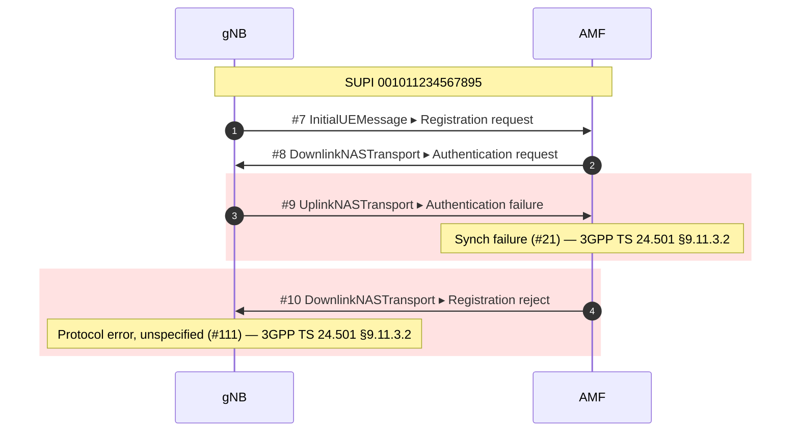

# TelcoLens

[](https://github.com/gollumw/TelcoLens/actions/workflows/ci.yml)

Turn a telecom signalling capture into a Mermaid sequence diagram you can paste
straight into GitHub — or anywhere else that renders Mermaid.

```bash
telcolens analyze failed_attach.pcapng
```



That is real output from `tests/fixtures/ki-mismatch`, not an illustration —
a UE provisioned with the wrong key, captured on a local Open5GS testbed. Note
that it is **not** the MAC failure you would expect: a UE whose K does not match
computes an AUTS the network cannot resynchronise from, so you get `#21` and
then a bare `#111`. The cause table says so because we ran it, not because it
sounded right.

Reading a 5G call flow in the Wireshark GUI means scrolling packet by packet,
and every unfamiliar cause code sends you back to the specs. TelcoLens turns the
capture into a diagram, names the network functions, and cites the clause the
cause code comes from.

**Status: early.** N2/NAS (NGAP + NAS-5GS), SBI, and PFCP are each exercised
against real testbed captures, including one that carries all three from a single
registration. What that capture does *not* contain is the long tail — see
[Honest limitations](#honest-limitations) before you rely on it.

---

## What it does today

- **Reads** NGAP, NAS-5GS, HTTP/2 SBI, and PFCP from `pcap` / `pcapng` via
  `tshark`.
- **Names the network functions** instead of showing IP addresses, and shows
  the IP when the evidence is ambiguous rather than guessing. Roles a test
  capture has actually produced: `gNB`, `AMF`, `AUSF`, `UDM`, `UDR`, `PCF`,
  `SMF`, `UPF`. The ambiguity rule is not decoration — in a deployment that
  routes SBI through an **SCP**, the proxy's address collects votes for five
  different NF types and stays an IP address, because a relay is not a
  producer.
- **Correlates one subscriber** across identifiers and across protocols: SUPI
  (recovered from a null-scheme SUCI in NAS, and from `imsi-…` / `suci-…` in
  SBI resource paths) and RAN/AMF UE NGAP IDs. A test capture ties the NGAP/NAS
  attach and the SBI exchanges behind it into **one** flow. HTTP/2 stream IDs
  are tracked separately, pairing a request with its response.
- **Needs to be told how to decode non-standard ports.** A capture that starts
  after the TCP connections are up has no HTTP/2 preface for `tshark` to find,
  so SBI silently decodes as raw data. Adapters declare the common cases
  (`DECODE_AS`); anything else goes through `--decode-as`.
- **One row per packet by default**, with the carrier and its payload stacked
  on the same line (`DownlinkNASTransport ▸ Authentication request`). Pass
  `--flow` to spread them out and draw NAS UE↔AMF instead — NAS is a UE↔AMF
  protocol that the gNB only relays, and seeing it that way is easier when you
  are learning a procedure rather than scanning one.
- **Times every gap.** The gutter carries the absolute timestamp *and* the
  delta from the row above, with second-long gaps highlighted — signalling runs
  on millisecond rhythms, so a hole that big is a timer waiting.
- **Cites the spec** for cause codes, from a hand-checked static table.
  Never generated, never guessed.
- **Exports two ways**: Mermaid for version control and GitHub, or a
  self-contained HTML report you can hand to someone else.

## Install

Requires Python 3.11+ and `tshark` (Wireshark 4.0 or newer recommended).
Tested on macOS, Linux, and Windows.

```bash
brew install --cask wireshark                       # macOS
sudo apt install tshark                             # Debian/Ubuntu
winget install WiresharkFoundation.Wireshark        # Windows

pip install telcolens
telcolens check                  # verifies tshark and dissectors
```

**Neither the macOS nor the Windows installer puts `tshark` on your `PATH`** —
macOS hides it inside `Wireshark.app`, and the Windows installer leaves the
"Add to PATH" box unchecked by default. TelcoLens looks in the standard install
directories, so it finds it anyway.

If you installed somewhere else, or you need to pin a specific Wireshark
version, point `TELCOLENS_TSHARK` at the binary:

```bash
export TELCOLENS_TSHARK=/path/to/tshark                      # macOS/Linux
setx TELCOLENS_TSHARK "C:\Program Files\Wireshark\tshark.exe"  # Windows
```

## Usage

```bash
telcolens analyze capture.pcapng                     # diagram to stdout
telcolens analyze capture.pcapng -o flow.mmd         # write Mermaid to a file
telcolens analyze capture.pcapng --html report.html  # standalone HTML report
telcolens analyze capture.pcapng --flow              # one row per message
telcolens analyze capture.pcapng --max-messages 80
telcolens analyze capture.pcapng --no-frames         # drop packet numbers
```

The diagram goes to stdout and the summary to stderr, so
`telcolens analyze x.pcapng > flow.mmd` gives you a clean file.

### The HTML report

`--html` writes one file you can double-click — no viewer, no toolchain, no
network. It draws its own SVG — colour-coded lanes, failures highlighted
in place, hover a message for the packet detail, expand a failure for the
plain-language explanation and the causes engineers actually hit in the field.

It is **completely self-contained**: no CDN, no web fonts, no remote images,
and **no JavaScript at all** (`<details>` for expanding, CSS for hover, SVG
`<title>` for tooltips). It opens on an air-gapped machine and inside strict
CSP. That is not a purity exercise — the whole point of this tool is that
customer captures do not leave the building, and a report that phones home to
a CDN tells an outside server that someone is looking at an analysis.

Output is byte-for-byte reproducible: no generation timestamp, so two runs
over the same capture diff cleanly.

### Two views

**The default is the wire view**: one row per packet, carrier and payload
stacked on the same line, protocol stack labelled. It is what you want when you
look at captures all day and already know the procedures — a whole registration
fits on one screen.

`--flow` gives you the other one: a captured NGAP frame carrying a NAS message
becomes **two** arrows, and the NAS one is drawn UE↔AMF because that is who is
actually talking. Looser, but it reads like a call flow, which is easier when
you are trying to understand a procedure rather than scan for the break.

Either way the gutter carries both the absolute timestamp (to find the packet
again in Wireshark) and the **delta from the previous row**. Gaps past one
second are highlighted: signalling runs on millisecond rhythms, so a second-long
hole is almost always a timer waiting, and that is usually where the fault is.

### In the browser

```bash
telcolens serve            # → http://localhost:3005
```

Drop a capture onto the page, or paste a path. You get **exactly** the report
`--html` produces — same code path, byte for byte.

**Paste the path for anything large.** It reads the file where it already is:
no copy, no temp file, starts immediately. Pushing a few hundred MB through
HTTP to a server on the same machine buys you nothing. Uploaded files live in
the system temp directory only while they are being analysed and are deleted
as soon as the report is rendered — that path is for convenience, not for the
2 GB capture from a customer site.

Analysis is synchronous with no intermediate progress to report, so a large
capture will sit there looking hung until the whole report appears. It has not
crashed. We have not measured where "large" starts — every capture we have is
small enough to finish instantly.

The server binds `127.0.0.1` only and checks the `Host` header. It runs
`tshark` on paths you hand it, so **do not put it on a public interface**.
Drag-and-drop needs JavaScript; the paste-a-path form does not — which means
the large-capture path works with scripting turned off.

> A flow is only badged **正常 / normal** when nothing was hidden from us.
> If the capture contains ciphered NAS, the badge reads **未見失敗 /
> no failure seen** instead — because not seeing a failure is not the same
> as there not being one.

## Honest limitations

- **SBI is verified against exactly one deployment.** `tests/fixtures/5gc-e2e/`
  is Open5GS with an SCP in the path, so the service-name-to-NF mapping and the
  SUPI extraction are exercised — but only for the services that deployment
  emits, and only for null-scheme SUCIs. Real SBI is usually TLS encrypted; you
  need a testbed or cleartext h2c to see inside at all.
- **PFCP carries no cause explanations.** The adapter reads message types and
  SEIDs and marks failures, but TS 29.244's cause table has not been
  transcribed yet, so a failed N4 message is highlighted without a clause
  citation. Transcribing that table is manual work by design — no clause number
  in this repo is machine-generated.
- **N4 does not join the subscriber's flow.** No message carries both a SUPI and
  a PFCP SEID, so the union-find has nothing to join them on. The N4 session
  renders as its own flow rather than an invented link.
- **Failure highlighting is verified against real testbed captures**, not
  synthetic ones — see `tests/fixtures/`, where each scenario ships the
  core-network log that independently confirms the cause code. What is *not*
  covered is the long tail: the cause table holds the codes we have actually
  seen, and anything else prints "尚未收錄" rather than a guess.
- **NAS after Security Mode Command is encrypted** and its content is invisible.
  Those packets still appear as their NGAP carrier. This is how the network
  works, not a parsing failure.
- **Mermaid gets slow with very large flows.** Use `--max-messages`; truncation
  is always stated inside the diagram, never silent.

## Where this is going

The real gap in the open-source tooling is not drawing 5G call flows — it is
**correlating one subscriber across protocol boundaries**. Debugging VoLTE or
VoWiFi spans SIP (IMS), Diameter (Cx/Dx/Rx/S6a/SWx/SWm), GTP/NAS (EPC), and
NGAP (5G), and no open tool stitches those into a single diagram.

The architecture is built for that from day one: protocols are pluggable
adapters registered through entry points, and the identity model already has
slots for IMPI, IMPU, MSISDN, SIP Call-ID, Diameter Session-Id, and GTP TEID.

The goal is that adding IMS means adding adapters rather than rewriting the
core. That is a goal, not yet a proven property — wiring up SBI already forced
one new axis into the adapter contract (`DECODE_AS`, because a display filter
alone does not make tshark decode a protocol on a non-standard port). Expect
IMS to find more.

Planned, in order: IMS adapters (SIP, Diameter, GTP) → local-LLM root cause
annotation over the extracted facts → optional web UI.

## Prior art, and why this exists anyway

These tools came first and are worth your time. TelcoLens is not trying to
replace them.

| Project | What it does | Why TelcoLens still exists |
|---|---|---|
| [telekom/5g-trace-visualizer](https://github.com/telekom/5g-trace-visualizer) | pcap → SVG sequence diagrams for 5GC (HTTP/2, NAS, PFCP). Deutsche Telekom, Apache-2.0. | Unmaintained since Aug 2023. PlantUML output needs `plantuml.jar`; driven from Jupyter notebooks with a large config surface aimed at k8s deployments. |
| [irontec/sngrep](https://github.com/irontec/sngrep) | Excellent, actively maintained ncurses SIP flow viewer. | Terminal-only and SIP-only — you cannot paste its output into a document, and it does not touch 5G. |
| [sipcapture/homer](https://github.com/sipcapture/homer) | Full capture platform: server, agents, database, web UI. | It is infrastructure you deploy and operate. TelcoLens is a command you run against one file. |
| [dgudtsov/pcap2uml](https://github.com/dgudtsov/pcap2uml) | IMS call flows across SIP/Diameter/MAP/CAMEL → PlantUML. | The closest in spirit. No 5G support (no NGAP/NAS-5GS), PlantUML output. |
| [agranig/pcap2mermaid](https://github.com/agranig/pcap2mermaid) | SIP → Mermaid, in Perl. | Two days of commits in January 2019, then nothing. It proved people want this; nobody picked it up. |

What none of them do together: 5G **and** IMS in one correlated diagram, Mermaid
as the output, and a spec-cited explanation of what went wrong.

## How it is verified

Getting a diagram to appear is easy. Getting a *complete* one is the hard part —
a flow missing three messages looks exactly like a correct one, with no error
anywhere. So the test suite cross-checks against `tshark` as an independent
oracle rather than only asserting on our own parse:

```bash
pytest
```

- Message counts must match `tshark -Y ngap -T fields -e frame.number | wc -l`.
- Procedure-code and NAS message-type names are compared against `tshark`'s own
  info column, so a typo in the spec tables fails the build.
- Every cause table entry must declare a spec and clause.
- The multi-message frame case is pinned with a real capture where one frame
  carries four HTTP/2 streams.

Test captures live in `tests/fixtures/`, one directory per scenario, each with the
capture, the core network's own logs, and a `scenario.md` explaining what it contains
and how to regenerate it. `5gc-registration/` (N2 only) and `5gc-e2e/` (N2 + SBI +
N4, captured at three disjoint points and merged) were both produced on a local
Open5GS + UERANSIM testbed, so they carry this repo's licence and no third-party
constraints.

**What the green badge does and does not mean.** CI runs the full suite on Python
3.11/3.12/3.13 (Linux) plus 3.13 on macOS and Windows — five jobs, three operating
systems, and whatever tshark each of them ships. No skips, so the cross-checks
above genuinely run. It does **not** cover IMS, TLS-protected SBI, ECIES-protected
SUCIs, or any deployment other than the one Open5GS topology the fixtures came from.
Those gaps are real and are named in `.github/workflows/ci.yml`.

## License

Apache-2.0. See [LICENSE](LICENSE).
