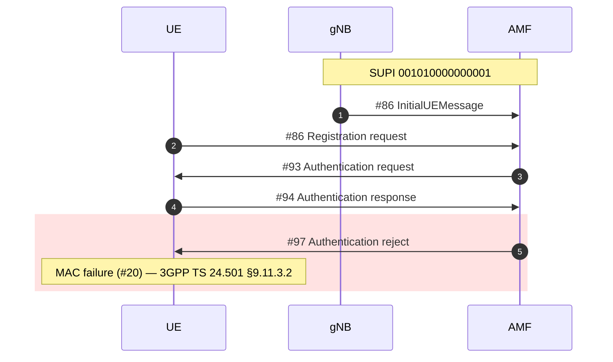

# TelcoLens

[](https://github.com/gollumw/TelcoLens/actions/workflows/ci.yml)

Turn a telecom signalling capture into a Mermaid sequence diagram you can paste
straight into GitHub, Notion, or Confluence.

```bash
telcolens analyze failed_attach.pcapng
```



Reading a 5G call flow in the Wireshark GUI means scrolling packet by packet,
and every unfamiliar cause code sends you back to the specs. TelcoLens turns the
capture into a diagram, names the network functions, and cites the clause the
cause code comes from.

**Status: early.** 5G core (N2/NAS) works end to end. See
[Honest limitations](#honest-limitations) before you rely on it.

---

## What it does today

- **Reads** NGAP, NAS-5GS, and HTTP/2 SBI from `pcap` / `pcapng` via `tshark`.
- **Names the network functions** — participants show up as `gNB`, `AMF`, `SMF`,
  `UPF`, not as IP addresses. When the evidence is ambiguous it shows the IP
  rather than guessing.
- **Correlates one subscriber** across identifiers: SUPI (recovered from a
  null-scheme SUCI), RAN/AMF UE NGAP IDs, HTTP/2 stream IDs.
- **Draws NAS from the UE.** NAS is a UE↔AMF protocol that the gNB relays
  transparently, so that is where the arrows go — not squeezed onto the gNB↔AMF
  hop where the packets happened to be captured.
- **Cites the spec** for cause codes, from a hand-checked static table.
  Never generated, never guessed.

## Install

Requires Python 3.11+ and `tshark` (Wireshark 4.0 or newer recommended).

```bash
brew install --cask wireshark    # macOS; or apt install tshark
pip install telcolens
telcolens check                  # verifies tshark and dissectors
```

On macOS, `tshark` ships inside `Wireshark.app` and is not on your `PATH`.
TelcoLens finds it anyway. Point `TELCOLENS_TSHARK` at a specific binary if you
need to pin a Wireshark version.

## Usage

```bash
telcolens analyze capture.pcapng                  # diagram to stdout
telcolens analyze capture.pcapng -o flow.mmd      # write to a file
telcolens analyze capture.pcapng --max-messages 80
telcolens analyze capture.pcapng --no-frames      # drop packet numbers
```

The diagram goes to stdout and the summary to stderr, so
`telcolens analyze x.pcapng > flow.mmd` gives you a clean file.

## Honest limitations

- **SBI is structurally parsed but not semantically verified.** No public 5G SBI
  capture was available to test against; the HTTP/2 message splitting is
  verified, the service-name-to-NF mapping is not. Real SBI is usually TLS
  encrypted anyway — you need a testbed or cleartext h2c to see inside.
- **PFCP is not implemented yet.** No test capture, so no code.
- **Failure highlighting is verified on synthetic data only.** None of the
  public captures we could find contain a failing procedure with a cause code.
- **NAS after Security Mode Command is encrypted** and its content is invisible.
  Those packets still appear as their NGAP carrier. This is how the network
  works, not a parsing failure.
- **Mermaid gets slow with very large flows.** Use `--max-messages`; truncation
  is always stated inside the diagram, never silent.

## Where this is going

The real gap in the open-source tooling is not drawing 5G call flows — it is
**correlating one subscriber across protocol boundaries**. Debugging VoLTE or
VoWiFi spans SIP (IMS), Diameter (Cx/Dx/Rx/S6a/SWx/SWm), GTP/NAS (EPC), and
NGAP (5G), and no open tool stitches those into a single diagram.

The architecture is built for that from day one: protocols are pluggable
adapters, and the identity model already has slots for IMPI, IMPU, MSISDN, SIP
Call-ID, Diameter Session-Id, and GTP TEID. Adding IMS means adding adapters,
not rewriting the core.

Planned, in order: IMS adapters (SIP, Diameter, GTP) → local-LLM root cause
annotation over the extracted facts → optional web UI.

## Prior art, and why this exists anyway

These tools came first and are worth your time. TelcoLens is not trying to
replace them.

| Project | What it does | Why TelcoLens still exists |
|---|---|---|
| [telekom/5g-trace-visualizer](https://github.com/telekom/5g-trace-visualizer) | pcap → SVG sequence diagrams for 5GC (HTTP/2, NAS, PFCP). Deutsche Telekom, Apache-2.0. | Unmaintained since Aug 2023. PlantUML output needs `plantuml.jar`; driven from Jupyter notebooks with a large config surface aimed at k8s deployments. |
| [irontec/sngrep](https://github.com/irontec/sngrep) | Excellent, actively maintained ncurses SIP flow viewer. | Terminal-only and SIP-only — you cannot paste its output into a document, and it does not touch 5G. |
| [sipcapture/homer](https://github.com/sipcapture/homer) | Full capture platform: server, agents, database, web UI. | It is infrastructure you deploy and operate. TelcoLens is a command you run against one file. |
| [dgudtsov/pcap2uml](https://github.com/dgudtsov/pcap2uml) | IMS call flows across SIP/Diameter/MAP/CAMEL → PlantUML. | The closest in spirit. No 5G support (no NGAP/NAS-5GS), PlantUML output. |
| [agranig/pcap2mermaid](https://github.com/agranig/pcap2mermaid) | SIP → Mermaid, in Perl. | Two days of commits in January 2019, then nothing. It proved people want this; nobody picked it up. |

What none of them do together: 5G **and** IMS in one correlated diagram, Mermaid
as the output, and a spec-cited explanation of what went wrong.

## How it is verified

Getting a diagram to appear is easy. Getting a *complete* one is the hard part —
a flow missing three messages looks exactly like a correct one, with no error
anywhere. So the test suite cross-checks against `tshark` as an independent
oracle rather than only asserting on our own parse:

```bash
pytest
```

- Message counts must match `tshark -Y ngap -T fields -e frame.number | wc -l`.
- Procedure-code and NAS message-type names are compared against `tshark`'s own
  info column, so a typo in the spec tables fails the build.
- Every cause table entry must declare a spec and clause.
- The multi-message frame case is pinned with a real capture where one frame
  carries four HTTP/2 streams.

Test captures are not committed — see `tests/conftest.py` for why.

**What the green badge does and does not mean.** CI runs the suite on Python
3.11/3.12/3.13 (Linux) and 3.13 (macOS), against three different tshark versions.
But the 18 tests that need a real capture — including the tshark cross-check — skip
there, so CI runs 44 of 62. It catches regressions in parsing logic, rendering, cause
lookup, and platform support. It does **not** verify extraction correctness against
real traffic. Closing that gap needs a self-hosted Open5GS testbed producing
publishable fixtures.

## License

Apache-2.0. See [LICENSE](LICENSE).
