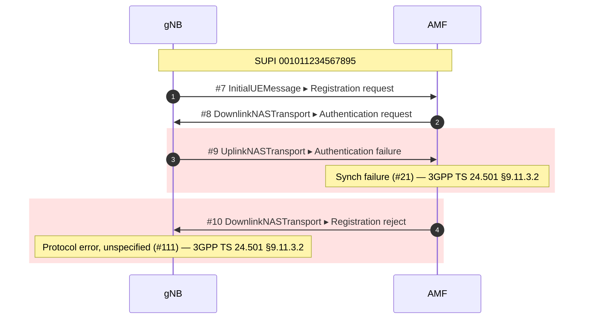
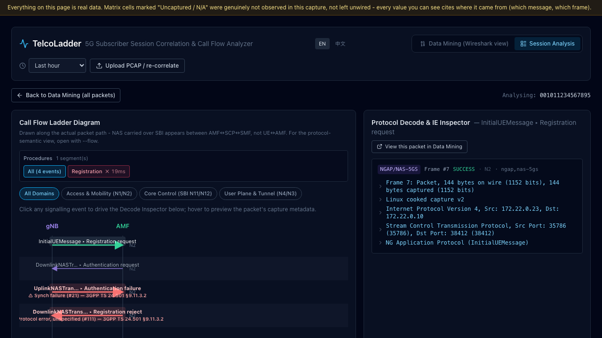

# TelcoLadder

[](https://github.com/gollumw/TelcoLadder/actions/workflows/ci.yml)

Point it at a 5G core capture and get the call flow **per subscriber, with every
failure explained**: NGAP, NAS, SBI, PFCP and GTP-U correlated into one timeline,
each cause code resolved to the 3GPP clause it comes from, each network function
named instead of shown as an IP. The output is Mermaid you can paste into GitHub,
or an interactive viewer in your browser.

```bash
telcoladder analyze failed_attach.pcapng
```



That is real output from `tests/fixtures/ki-mismatch`, not an illustration —
a UE provisioned with the wrong key, captured on a local Open5GS testbed. Note
that it is **not** the MAC failure you would expect: a UE whose K does not match
computes an AUTS the network cannot resynchronise from, so you get `#21` and
then a bare `#111`. The cause table says so because we ran it, not because it
sounded right.

Reading a 5G call flow in the Wireshark GUI means scrolling packet by packet,
and every unfamiliar cause code sends you back to the specs. TelcoLadder turns the
capture into a diagram, names the network functions, and cites the clause the
cause code comes from.

The same capture in the browser: a packet list with real tshark display filters,
per-frame decode tree and hex, the subscriber list, the ladder, and a per-PDU-session
correlation matrix where **every cell cites the frame it came from**.

```bash
telcoladder serve            # → http://localhost:3005, drop a capture on the page
```



> Named after the ladder diagram — the call-flow drawing every telecom engineer has
> squinted at. The name is narrower than the tool: the browser view, the
> per-procedure xDR export and the PDU-session matrix are not ladders. It stuck anyway.

> 中文使用指南（面向真實封包的操作與能力邊界）：[docs/使用指南.md](docs/使用指南.md)

**Status: early.** N2/NAS (NGAP + NAS-5GS), SBI, N4 (PFCP), and N3 (GTP-U) are
each exercised against real testbed captures, including one that carries N2, SBI
and N4 from a single registration, and one where the N3 tunnel endpoint is
byte-for-byte the one NGAP promised. What those captures do *not* contain is
the long tail — see [Honest limitations](#honest-limitations) before you rely
on it.

---

## What it does today

- **Reads** NGAP, NAS-5GS, HTTP/2 SBI, PFCP, and GTP-U from `pcap` / `pcapng`
  via `tshark` — control plane and user plane in the same timeline.
- **Names the network functions** instead of showing IP addresses, and shows
  the IP when the evidence is ambiguous rather than guessing. Roles a test
  capture has actually produced: `gNB`, `AMF`, `SCP`, `AUSF`, `UDM`, `UDR`,
  `PCF`, `SMF`, `UPF`.
- **Understands relays.** A production core almost always has one — a 5G
  **SCP**, a Diameter **DRA**, a SIP proxy — and then every message's wire peer
  is the middlebox, not the network function you care about. TelcoLadder reads the
  target the message *names* (`3gpp-Sbi-Target-apiRoot` for SBI) rather than the
  address it was sent to, labels the relay as what it is, and refuses to
  attribute the services behind it to it. The relay keeps its own lane, so a
  forward that never happened is still visible.
- **Correlates one subscriber** across identifiers and across protocols: SUPI
  (recovered from a null-scheme SUCI in NAS, and from `imsi-…` / `suci-…` in
  SBI resource paths) and RAN/AMF UE NGAP IDs. On a testbed capture — null-scheme
  SUCI, cleartext h2c — the NGAP/NAS attach and the SBI exchanges behind it land
  in **one** flow. On a production trace with TLS on SBI and ECIES-protected SUCIs
  the N2 side still forms its own per-UE flow; what could not be read is counted
  and reported, not silently dropped. HTTP/2 stream IDs are tracked separately,
  pairing a request with its response.
- **Needs to be told how to decode non-standard ports.** A capture that starts
  after the TCP connections are up has no HTTP/2 preface for `tshark` to find,
  so SBI silently decodes as raw data. Adapters declare the common cases
  (`DECODE_AS`); anything else goes through `--decode-as`.
- **One row per packet by default**, with the carrier and its payload stacked
  on the same line (`DownlinkNASTransport ▸ Authentication request`). Pass
  `--flow` to spread them out and draw NAS UE↔AMF instead — NAS is a UE↔AMF
  protocol that the gNB only relays, and seeing it that way is easier when you
  are learning a procedure rather than scanning one.
- **Times every gap.** The gutter carries the absolute timestamp *and* the
  delta from the row above, with second-long gaps highlighted — signalling runs
  on millisecond rhythms, so a hole that big is a timer waiting.
- **Cites the spec** for cause codes, from a hand-checked static table.
  Never generated, never guessed.
- **Splits a subscriber's traffic into procedures** — registration, PDU session
  establishment, service request, deregistration — each with its own outcome,
  cause, root cause and duration. A long capture of one subscriber is three
  attaches, not one undifferentiated flow, and the question engineers actually
  ask is "why did the *second* one fail".
- **Exports procedure records as JSON** (`--xdr`), one object per procedure:
  who, which procedure, outcome, cause and root cause, duration. Byte-for-byte
  reproducible for the same capture, so `jq` can answer "what is the failure
  rate across this batch" without anyone reading a diagram.
- **Speaks English or Traditional Chinese** — `--lang zh_TW`, or the EN / 中文
  switch in the browser. Deliberately not the system locale; see
  [Language](#language).
- **Summarises a capture for an AI agent, or for a ticket** (`summarize`):
  one page of deterministic facts — frames decoded, **what could not be read**,
  network elements, subscribers, procedures with outcomes, every failure with
  its 3GPP cause reference. Markdown or JSON, byte-for-byte reproducible.
  Nothing in it is generated: unobserved fields are `null`, not estimates.
- **Runs as an MCP server** (`telcoladder mcp`) so Claude Code, Cursor or any
  MCP client can call `summarize_capture`, `list_subscribers`,
  `get_subscriber_callflow` and `diagnose_failures` as tools. Stdio only, no
  network listener, no extra dependencies.
- **Three ways to look at it**: `analyze` writes Mermaid — a text file you can
  version-control, diff, and paste into GitHub; `serve` opens an interactive
  browser view of the same capture (packet list with real tshark display
  filters, per-frame decode tree, the call-flow ladder, a PDU-session
  correlation matrix); `summarize` writes the one-page summary above. There is
  no rendered report format — see the note on the retired `--html` report below.

## Install

Requires Python 3.11+ and `tshark` (Wireshark 4.0 or newer recommended).
Tested on macOS, Linux, and Windows.

```bash
brew install --cask wireshark                       # macOS
sudo apt install tshark                             # Debian/Ubuntu
winget install WiresharkFoundation.Wireshark        # Windows

pip install git+https://github.com/gollumw/TelcoLadder
telcoladder check                  # verifies tshark and dissectors
```

> **Not on PyPI yet.** Install from git until the first tagged release. There
> is no build step: the browser interface is committed as a built bundle, so
> you do not need Node.

**Neither the macOS nor the Windows installer puts `tshark` on your `PATH`** —
macOS hides it inside `Wireshark.app`, and the Windows installer leaves the
"Add to PATH" box unchecked by default. TelcoLadder looks in the standard install
directories, so it finds it anyway.

If you installed somewhere else, or you need to pin a specific Wireshark
version, point `TELCOLADDER_TSHARK` at the binary:

```bash
export TELCOLADDER_TSHARK=/path/to/tshark                      # macOS/Linux
setx TELCOLADDER_TSHARK "C:\Program Files\Wireshark\tshark.exe"  # Windows
```

## Usage

```bash
telcoladder analyze capture.pcapng                     # diagram to stdout
telcoladder analyze capture.pcapng -o flow.mmd         # write Mermaid to a file
telcoladder analyze capture.pcapng --flow              # one row per message
telcoladder analyze capture.pcapng --max-messages 80
telcoladder analyze capture.pcapng --no-frames         # drop packet numbers
telcoladder analyze capture.pcapng --xdr flows.json    # procedure records for scripts
telcoladder summarize capture.pcapng                   # one-page summary (Markdown)
telcoladder summarize capture.pcapng --json            # same facts as JSON
```

On a large capture, narrow it before you draw it:

```bash
telcoladder analyze big.pcapng --subscriber 001011234567895
telcoladder analyze big.pcapng --since 120 --until 180
telcoladder analyze big.pcapng --filter 'ngap || http2'
```

Narrowing by subscriber expands in two steps — the packets that carry the
identifier, then the TCP streams and SCTP associations those belong to —
because most packets carry no identifier at all and filtering on it directly
would drop the whole N2 interface. **Whatever it could not reach is listed
explicitly**, never silently dropped.

The diagram goes to stdout and the summary to stderr, so
`telcoladder analyze x.pcapng > flow.mmd` gives you a clean file.

### Language

Everything the tool says — `--help`, the analysis summary, error messages, the
browser interface — is English by default and available in Traditional Chinese:

```bash
telcoladder analyze capture.pcapng --lang zh_TW
export TELCOLADDER_LANG=zh_TW                    # or set it once
```

In the browser there is an **EN / 中文** switch in the header; the choice is
remembered per browser. The tool deliberately ignores the system locale and the
browser's `Accept-Language`: the same command on two machines should print the
same words, because the output gets pasted into tickets.

The Mermaid diagram itself is language-independent — cause names are the spec's
own English, and clause citations are clause citations. GitHub, GitLab,
Obsidian and Notion render Mermaid inline, so the `.mmd` pastes straight into an
issue or an RCA document; `telcoladder serve` shows it rendered right now.

### Output is Mermaid, and it stays that way

The diagram is text. It diffs, it reviews, it pastes into a GitHub comment or a
ticket, and it survives your company's document pipeline — which is more than a
screenshot of a probe UI can say.

Output is byte-for-byte reproducible: no generation timestamp, so two runs over
the same capture diff cleanly.

> **There used to be a `--html` report.** It was retired in August 2026. It drew
> its own SVG in Python, which meant every layout rule — lane order, colour
> groups, the slow-gap threshold — existed twice: once there and once in the
> browser UI. Two implementations of the same judgement drift, and the drift is
> silent. The browser view is now the only rendered surface; Mermaid is the only
> file this tool writes.

### Two views

**The default is the wire view**: one row per packet, carrier and payload
stacked on the same line, protocol stack labelled. It is what you want when you
look at captures all day and already know the procedures — a whole registration
fits on one screen.

`--flow` gives you the other one: a captured NGAP frame carrying a NAS message
becomes **two** arrows, and the NAS one is drawn UE↔AMF because that is who is
actually talking. Looser, but it reads like a call flow, which is easier when
you are trying to understand a procedure rather than scan for the break.

Either way the browser ladder carries the **delta from the previous message**,
and gaps past one second are flagged: signalling runs on millisecond rhythms, so
a second-long hole is almost always a timer waiting, and that is usually where
the fault is.

### In the browser

```bash
telcoladder serve            # → http://localhost:3005
```

Drop a capture onto the page, or paste a path. This is the full interface:
a Wireshark-style packet list with real tshark display filters, per-frame decode
trees and hex, the subscriber list, the call-flow ladder, and a PDU-session
correlation matrix where **every cell cites the message and frame it came from**.

**Paste the path for anything large.** It reads the file where it already is:
no copy, no temp file, starts immediately. Pushing a few hundred MB through HTTP
to a server on the same machine buys you nothing.

Uploaded files are different: drilling into a capture means reading it again on
later requests, so an upload is kept in the system temp directory (mode 0600)
until you release it or it idles out — 15 minutes by default, `--idle-ttl` to
change, `--no-viewer` to refuse uploads entirely. That path is for convenience,
not for the 2 GB capture from a customer site.

The server binds `127.0.0.1` only and checks the `Host` header. It runs
`tshark` on paths you hand it, so **do not put it on a public interface**.
Drag-and-drop needs JavaScript; the paste-a-path form does not — which means
the large-capture path works with scripting turned off.

> **When something was hidden from us, the page says so.** A capture with
> ciphered NAS or ECIES-protected SUCIs gets a banner counting exactly what
> could not be read, above everything else — because a clean-looking procedure
> list is indistinguishable from one where the failure is inside a message we
> could not open. Not seeing a failure is not the same as there not being one.

### For an AI agent

```bash
telcoladder summarize capture.pcapng            # paste into the prompt, or into the ticket
claude mcp add telcoladder -- telcoladder mcp   # or mount it as tools
```

`summarize` is the same analysis as `analyze` and `serve`, written as one page an
agent can read without hallucinating a state machine: what the capture contains,
**what could not be read** (ciphered NAS, ECIES-protected SUCIs, frames no
dissector claimed, narrowing, automatic decode adjustments), the network elements
and their roles, every subscriber with its PDU sessions, every procedure with its
outcome and duration, and every failure with its 3GPP cause — table, value, name,
spec and clause, all from the hand-checked table. `--json` gives the same facts
with a pinned field set; both are byte-for-byte reproducible.

The MCP server exposes the same facts as four tools over stdio. It is spawned by
the client on the same machine and runs `tshark` on the paths it is handed, so
there is deliberately no HTTP transport. One analysis per file is cached in
memory for the session; nothing is copied or written to disk.

Two honest gaps: the cause explanations and common root causes in the table are
currently written in Traditional Chinese only (the spec names and clause numbers
are language-neutral); and the summary lists only identifiers the adapters
actually extract — there is no 5G-GUTI/TMSI field, because nothing reads one yet.

## Where this is going

The real gap in the open-source tooling is not drawing 5G call flows — it is
**correlating one subscriber across protocol boundaries**. Debugging VoLTE or
VoWiFi spans SIP (IMS), Diameter (Cx/Dx/Rx/S6a/SWx/SWm), GTP/NAS (EPC), and
NGAP (5G), and no open tool stitches those into a single diagram.

The architecture is built for that from day one: protocols are pluggable
adapters registered through entry points, and the identity model already has
slots for IMPI, IMPU, MSISDN, SIP Call-ID, Diameter Session-Id, and GTP TEID.

The goal is that adding IMS means adding adapters rather than rewriting the
core. That is a goal, not yet a proven property — wiring up SBI already forced
one new axis into the adapter contract (`DECODE_AS`, because a display filter
alone does not make tshark decode a protocol on a non-standard port). Expect
IMS to find more.

Planned, in order: IMS adapters (SIP, Diameter) and EPC (GTP-C, NAS-EPS) →
local-LLM root-cause narration over the extracted facts and the cause table.
The model narrates; it never produces a clause number — that rule is in
`CONTRIBUTING.md` and it applies to the model too.

## Prior art, and why this exists anyway

These tools came first and are worth your time. TelcoLadder is not trying to
replace them.

| Project | What it does | Why TelcoLadder still exists |
|---|---|---|
| [telekom/5g-trace-visualizer](https://github.com/telekom/5g-trace-visualizer) | pcap → SVG sequence diagrams for 5GC (HTTP/2, NAS, PFCP). Deutsche Telekom, Apache-2.0. | Unmaintained since Aug 2023. PlantUML output needs `plantuml.jar`; driven from Jupyter notebooks with a large config surface aimed at k8s deployments. |
| [irontec/sngrep](https://github.com/irontec/sngrep) | Excellent, actively maintained ncurses SIP flow viewer. | Terminal-only and SIP-only — you cannot paste its output into a document, and it does not touch 5G. |
| [sipcapture/homer](https://github.com/sipcapture/homer) | Full capture platform: server, agents, database, web UI. | It is infrastructure you deploy and operate. TelcoLadder is a command you run against one file. |
| [dgudtsov/pcap2uml](https://github.com/dgudtsov/pcap2uml) | IMS call flows across SIP/Diameter/MAP/CAMEL → PlantUML. | The closest in spirit. No 5G support (no NGAP/NAS-5GS), PlantUML output. |
| [agranig/pcap2mermaid](https://github.com/agranig/pcap2mermaid) | SIP → Mermaid, in Perl. | Two days of commits in January 2019, then nothing. It proved people want this; nobody picked it up. |

What none of them do together: 5G **and** IMS in one correlated diagram, Mermaid
as the output, and a spec-cited explanation of what went wrong.

## How it is verified

Getting a diagram to appear is easy. Getting a *complete* one is the hard part —
a flow missing three messages looks exactly like a correct one, with no error
anywhere. So the test suite cross-checks against `tshark` as an independent
oracle rather than only asserting on our own parse:

```bash
pytest
```

- Message counts must match `tshark -Y ngap -T fields -e frame.number | wc -l`.
- Procedure-code and NAS message-type names are compared against `tshark`'s own
  info column, so a typo in the spec tables fails the build.
- Every cause table entry must declare a spec and clause.
- The multi-message frame case is pinned with a real capture where one frame
  carries four HTTP/2 streams.

Test captures live in `tests/fixtures/`, one directory per scenario, each with the
capture, the core network's own logs, and a `scenario.md` explaining what it contains
and how to regenerate it. `5gc-registration/` (N2 only) and `5gc-e2e/` (N2 + SBI +
N4, captured at three disjoint points and merged) were both produced on a local
Open5GS + UERANSIM testbed, so they carry this repo's licence and no third-party
constraints.

**What the badge does and does not mean.** Every push runs the full suite on
Python 3.11/3.12/3.13 on Linux; macOS and Windows (3.13) run weekly and on
demand. The cross-checks above genuinely run there — the fixtures are in the
repo, so nothing is skipped for want of a capture. It does **not** cover IMS,
TLS-protected SBI, ECIES-protected SUCIs, or any deployment other than the one
Open5GS topology the fixtures came from. Those gaps are real and are named at
the top of `.github/workflows/ci.yml`.

## Honest limitations

- **SBI is verified against exactly one deployment.** `tests/fixtures/5gc-e2e/`
  is Open5GS with an SCP in the path, so the service-name-to-NF mapping and the
  SUPI extraction are exercised — but only for the services that deployment
  emits, and only for null-scheme SUCIs. Real SBI is usually TLS-encrypted, so on
  a production trace you will not see inside SBI — but N2 is unaffected: you still
  get the per-UE registration flow, every NGAP cause, and NAS causes up to Security
  Mode Command, plus an explicit count of the SBI frames that could not be read.
  Testbeds and cleartext h2c are where the SBI *correlation* is exercised.
- **Relay detection needs the deployment to say so.** It keys on the target the
  message names — `3gpp-Sbi-Target-apiRoot` in SBI. A fully transparent SCP that
  sends no such header is indistinguishable from the real endpoint, and its
  address falls back to an unlabelled IP. That is the correct failure direction,
  but it is a real gap. Diameter will be sturdier here: a DRA may not rewrite
  `Origin-Host`, and it signs its own passage with a `Route-Record`.
- **PFCP carries no cause explanations.** The adapter reads message types and
  SEIDs and marks failures, but TS 29.244's cause table has not been
  transcribed yet, so a failed N4 message is highlighted without a clause
  citation. Transcribing that table is manual work by design — no clause number
  in this repo is machine-generated.
- **N4 joins the subscriber through the GTP-U tunnel endpoint, not the SEID.**
  No message carries both a SUPI and a PFCP SEID. What both sides *do* carry is
  the F-TEID the UPF allocates: it appears in the PFCP Session Establishment
  Response and again in NGAP's UP transport layer information on its way to the
  gNB. Keying on (address, TEID) merges them — flow counts drop from 9 to 7 on
  `5gc-e2e` and 25 to 15 on `multi-imsi`. The address matters: one capture had
  two different endpoints both using TEID 3.
  The same key now also joins the **user plane**: see the next entry.
- **Failure highlighting is verified against real testbed captures**, not
  synthetic ones — see `tests/fixtures/`, where each scenario ships the
  core-network log that independently confirms the cause code. What is *not*
  covered is the long tail: the cause table holds the codes we have actually
  seen, and anything else prints "not in this tool's cause table yet" rather
  than a guess.
- **GTP-U joins the subscriber, but carries no KPIs yet.** The `gtp` adapter
  (2026-08-21) keys each packet on (destination address, TEID) — the same
  `gtp_tunnel()` the signalling side emits — so user-plane packets land in the
  right subscriber's flow, QFI included (verified against a testbed capture
  where the N3 TEID is byte-for-byte the one NGAP promised, and the message
  count is cross-checked against tshark). What it does *not* do yet is
  aggregate: no throughput, no sequence-gap loss, no Echo RTT. Every G-PDU is
  one row — honest, but heavy user-plane captures will want `--since/--until`.
- **NAS after Security Mode Command is encrypted** and its content is invisible.
  Those packets still appear as their NGAP carrier. This is how the network
  works, not a parsing failure.
- **Mermaid gets slow with very large flows.** Use `--max-messages`; truncation
  is always stated inside the diagram, never silent.

## Contributing, and reporting problems

[`CONTRIBUTING.md`](CONTRIBUTING.md) is short. It has two rules that matter
more than anything else in it: **no real subscriber or customer data, anywhere**,
and **every spec clause is verified by a human, never generated**.

Found a vulnerability? [`SECURITY.md`](SECURITY.md) — not a public issue.

## License

Apache-2.0. See [LICENSE](LICENSE).
