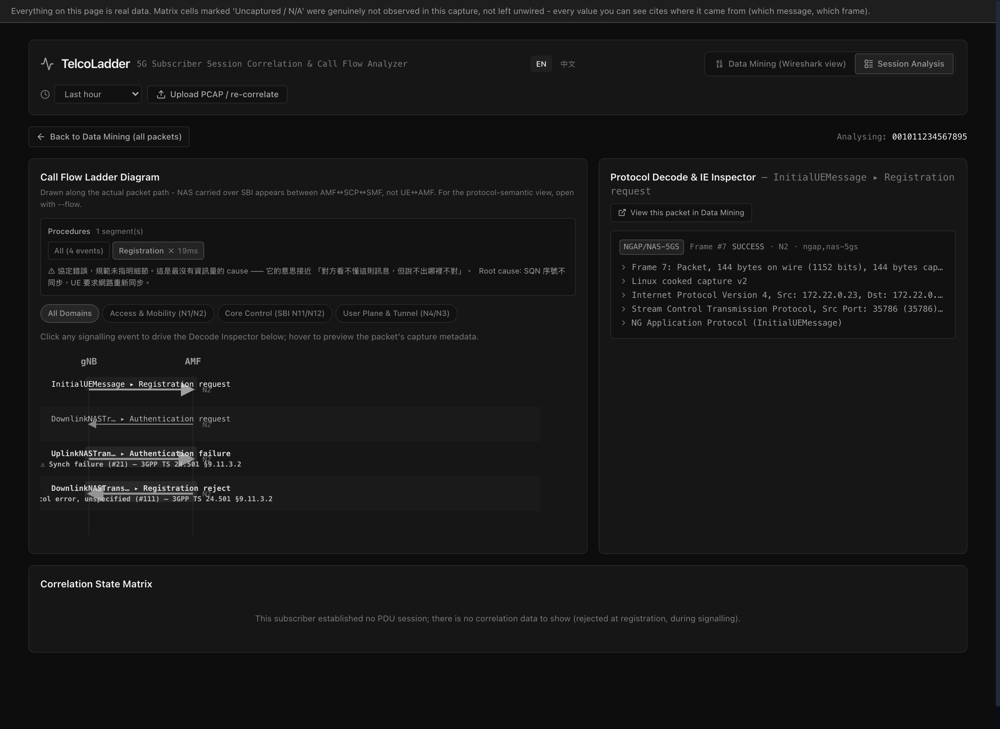
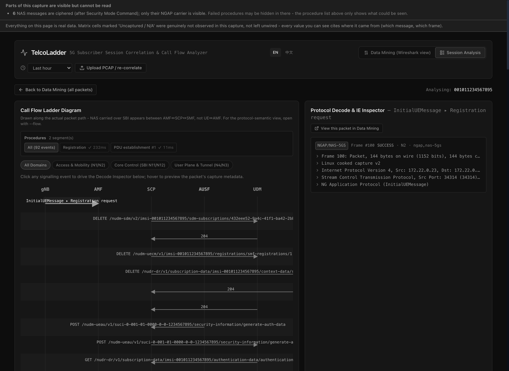
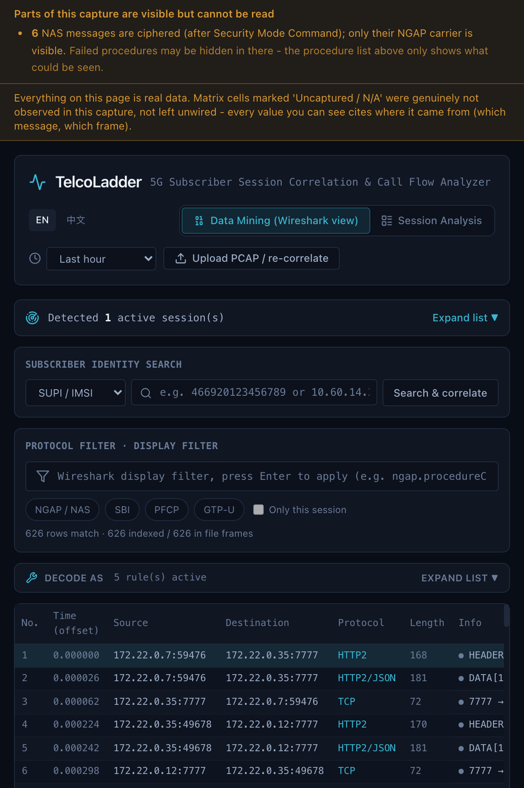
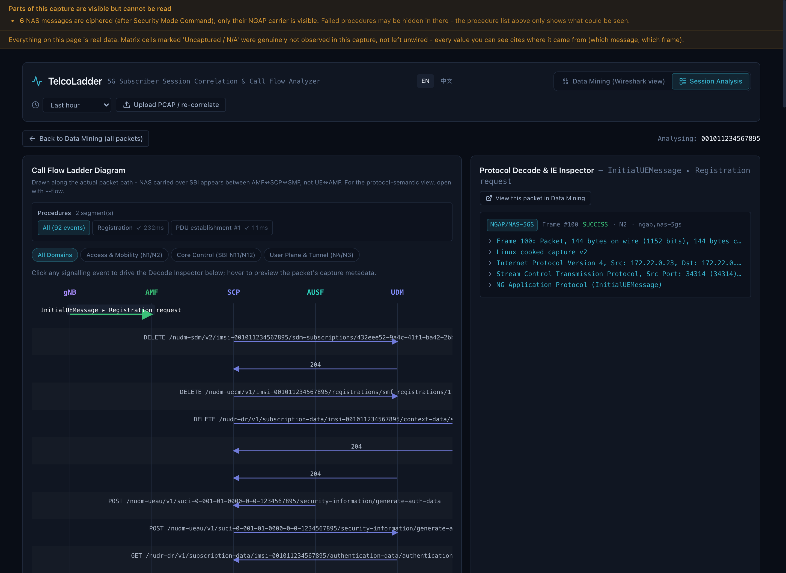
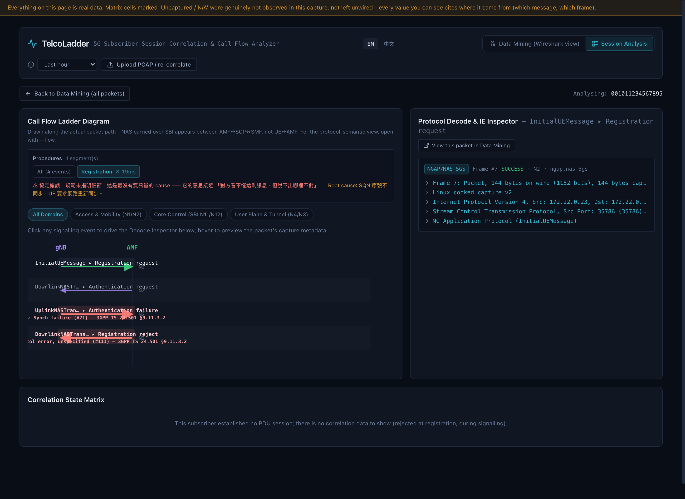
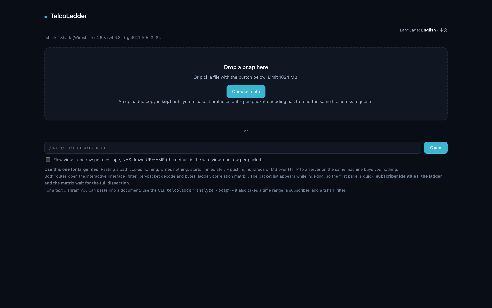
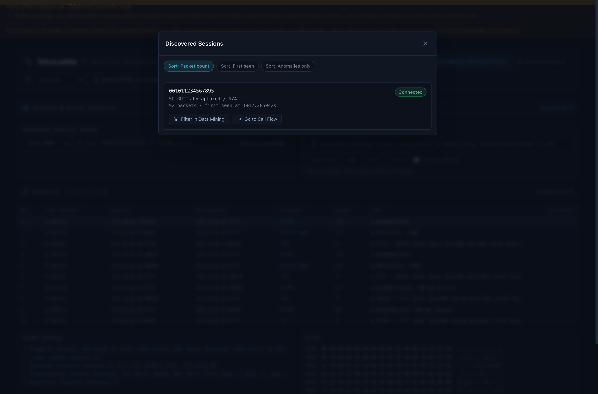
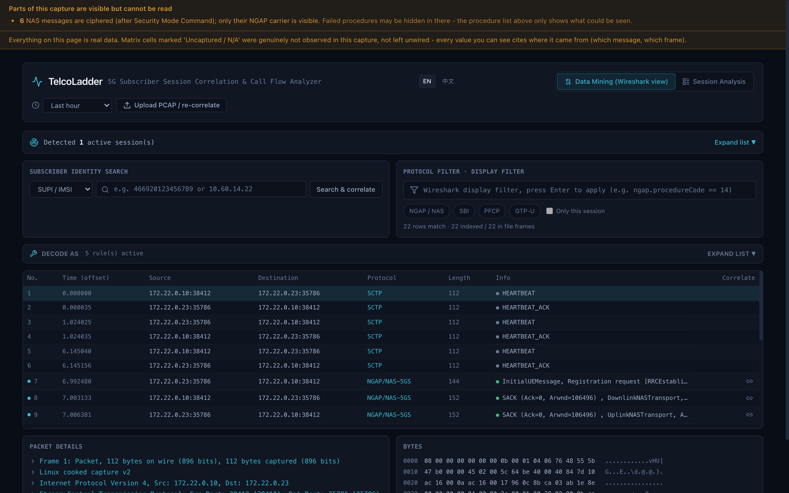

# TelcoLadder Semantic Colour Calibration and Visual System Report

## 1. Semantic colours: strict lightness alignment (L = 0.720–0.721)

The original "equal chroma" constraint is physically unattainable in sRGB, so
the palette instead **aligns Lightness strictly to 0.72 and sets Chroma to
~88% of each hue's sRGB gamut ceiling**.

### 1.1 Final colours and back-computed OKLCH values

> Basis: the standard OKLab/OKLCH transforms (Björn Ottosson, 2020). Canvas
> background: `#090d16` (back-computed OKLCH: `0.160 / 0.0203 / 265.6°`).

| Semantic role | Final sRGB | Lightness (L) | Chroma (C) | Hue (H) | Contrast vs canvas `#090d16` | WCAG |
| :--- | :--- | :--- | :--- | :--- | :--- | :--- |
| **Fail** (rose) | `#f67a73` | **0.721** | 0.1534 | 24.9° | **7.36:1** | AAA (7:1) ✓ |
| **Warn** (amber) | `#d59733` | **0.720** | 0.1336 | 74.9° | **7.68:1** | AAA (7:1) ✓ |
| **OK** (emerald) | `#3ac178` | **0.721** | 0.1571 | 155.0° | **8.40:1** | AAA (7:1) ✓ |
| **Accent** (cyan) | `#39b6d0` | **0.720** | 0.1120 | 214.8° | **8.12:1** | AAA (7:1) ✓ |

- **Maximum lightness spread**:
  $$\Delta L = L_{\max} - L_{\min} = 0.721 - 0.720 = \mathbf{0.001}$$
  (well inside the required $\pm 0.02$; the four colours carry equal
  perceptual weight, including in greyscale).
- **Contrast headroom**: all four comfortably exceed WCAG AA (4.5:1) and
  AAA (7.0:1).

---

## 2. Tests and invariant guards

1. **Front-end build**: `npm run build` — 0 warnings, producing
   `telcoladder/static/app.{js,css}`.
2. **Test suite**: `pytest` — **514 passed in 136 s** (including the 2 new
   tests for the decode tree's PDML `show` attribute and all 19 asset
   invariant tests).
3. **PORTED.json pinning**: `SessionAnalysisView.tsx`
   (`c1ac3dbc0e37f1d2a280f4d2a7fd3bf1592afff8abcad3065d095352e1f68410`) and
   every diverged file's hash recorded exactly.

---

## 3. Screenshot inventory

All screenshots are exported to `docs/images/`:

The README preview image [`docs/images/browser.png`](images/browser.png) is
updated to the latest render.
